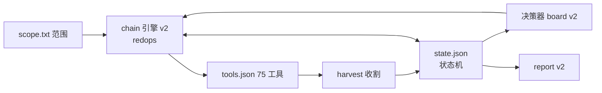

# 28-自动化编排规划

> 目标：把当前「人肉控制台 + Runbook」工具库演进为**自动化红队域渗透/内网工具**。
> 本文是唯一规划来源：现状评估 → 差距 → 目标架构 → 里程碑 → 验收。
> 原则：复用现有 console 执行引擎（serve.py run/chain + token 认证），不新建守护进程；状态用纯 JSON，不引入数据库；高危动作（中继/NTDS/委派写）保持人工确认。

## 一、现状：已具备的自动化能力（已验证）

| 能力 | 位置 | 说明 |
|---|---|---|
| 一键侦察流水线 | `bin/autopwn.sh` P1-P5 | 发现→用户→凭据→深度情报，多源回退（LDAP anon/RID brute/GetADUsers/GetNPUsers oracle） |
| 注册表执行引擎 | `redops/engine.py` run/run_chain | 75 工具（tools.json）+ 6 链（chains.json），参数 shlex.quote、sudo stdin、proxy 包装、超时、后台任务、per-start token |
| 凭据收割 | `redops/harvest.py harvest()` | secretsdump/dcsync/certipy-auth 输出 → 去重写入 `creds.csv`；TGS/ASREP 哈希 → `hashqueue.txt` |
| 项目工作区 | `projects/<name>/` | project.json（多域）、notes.md 时间线、history.jsonl、PROJ_DIR 注入 |
| 锁定感知喷洒 | `bin/spray-safe.sh` | pass-pol 解析失败拒喷、阈值≤2 拒喷、观察窗口节流、`--no-bruteforce` |
| 报告骨架 | `bin/report.sh` | creds.csv+project.json+history → report.md/html + 阶段覆盖矩阵 |
| 共享库地基 | `bin/lib/` | common/project/recon（dc_fqdn、intel_collect、resolve_project、季节密码生成器） |

## 二、差距清单（阻碍全自动化的缺失项，逐条已验证）

1. **无交战状态机** — 没有任何 owned-hosts / valid-creds / attacks-tried 的机器可读模型；看板「下一步」是对 history 做子串匹配（serve.py 旧 board 逻辑）。
2. **无断点续跑/幂等** — autopwn 重跑 = 全部重来且**有害**（每轮 +3 次/账号错误密码尝试；rbcd 链重跑 addcomputer 直接失败导致整链中断）。
3. **链内数据流断裂** — 每个 step 在**新建目录**里跑（`cwd=sd`），kerb/esc1/rbcd 链用相对路径传递文件（`hashqueue_kerb.txt`、`cert.pfx`、`$PWD/administrator.ccache`）全部解析到错误目录；无 stdout→参数 管道。
4. **凭据只写不读** — `creds.csv` 的 `用过没` 列永远 `未用`；hashcat 爆破结果不回流水 creds；没有任何工具/链从 creds.csv 取凭据。
5. **autopwn 游离于体系外** — 不写 creds.csv / hashqueue / history.jsonl / notes.md，发现的凭据要手工重录；产物死在 /tmp。
6. **无范围护栏** — 全库 grep 无 scope/exclude/黑名单机制；任何注册工具打任意目标字符串；`danger` 标志只是 UI 颜色。
7. **后台任务无结果捕获** — bg 运行永不记录 rc；responder 的 NetNTLM 哈希不被 harvest（只认 secretsdump/certipy 格式）。
8. **无目标资产清单** — 每次全 CIDR 重扫；无 host/service 库存。
9. **netcheck 门控是摆设** — `TIMEOUT_MULT` 导出后从未被任何命令使用。
10. **报告只有统计没有结论** — findings/严重度/证据/修复建议全手工。

## 三、目标架构



### 3.1 状态模型（`projects/<name>/state.json`）
```json
{
  "hosts":  {"10.0.0.1": {"role": "dc", "os": "...", "owned": false, "services": [88,445]}},
  "creds":  [{"id": "c1", "user": "...", "type": "nt|pass|pfx|ticket",
              "valid_for": ["10.0.0.1"], "last_verified": "ts", "source": "run-id"}],
  "tried":  {"<tool>:<target>:<paramhash>": {"ts": "...", "rc": 0}},
  "phases": {"P1": {"done": "ts", "artifact": "loot/runs/..."}}
}
```
- 写入方：harvest、run/run_chain 完成钩子、autopwn（经 bin/lib 的 `state_mark`/`state_tried` 助手）。
- `用过没` 列由 cred 被实际使用后回写取代。

### 3.2 链引擎 v2（chains.json 向后兼容扩展）
| 新字段 | 语义 |
|---|---|
| `cwd: "chain"` | 步骤共享链目录（修复差距 3，默认改为此） |
| `for_each: {"param": "u", "from_file": "users.txt"}` | 对文件逐行展开执行（循环 discovered set） |
| `when: "file_exists:cert.pfx"` / `when: "rc:0"` | 条件步骤（分支的最小可用形态） |
| `checkpoint: "kerb-roast"` | 断点；重跑时已完成 checkpoint 的步骤跳过（幂等） |
| `confirm: true` | danger 步骤需 API 显式确认参数（护栏落地） |

### 3.3 凭据反馈环
- 新增内部读取器：链参数支持 `{{cred:user}}`（从 state.json 取该主体最新有效凭据）。⬜ M4
- hashcat-queue 完成 → 解析 `--show` → harvest → creds.csv/state。⬜ M4
- responder out.log 增加 NetNTLMv2 解析 → hashqueue。✅ M2 已落地
- 凭据验证器：`nxc-verify` 成功 → `valid_for`/`last_verified` 回写。✅ M3 已落地

### 3.4 范围护栏（先于分支自动化落地）
- `projects/<name>/scope.txt`：允许的 CIDR/主机/域，一行一个；`!` 前缀为排除。
- redops/engine.py run/run_chain 入口校验 target 类参数 ∈ scope（项目激活时）；autopwn 启动时同样校验。
- 无 scope 文件 → 仅允许「只读枚举类」工具（tools.json 增加 `readonly: true` 标记）。

### 3.5 autopwn 归编
- ✅ M2/M3 实际路线：autopwn 保留 bash 主体，P1-P4 阶段 checkpoint 经 `state.py`（`phase mark/check` + 产物按相位落 `projects/<name>/apn-<RUNID>/pN`），重跑命中即跳过、零新增密码尝试；凭据经 `cred_log`+`state_cred_add/use` 落 creds.csv 与 state.json。改写为 chain v2 的 CLI 薄壳方案推迟（价值/风险比低）。
- `TIMEOUT_MULT` 真正乘进 nxc/hashcat 超时参数。

## 四、里程碑

| 里程碑 | 内容 | 状态 |
|---|---|---|
| **M1 地基** | bug 修复全量、bin/lib 共享库、引号约定统一、API token | ✅ 已完成 |
| **M2 数据流** | 链共享 cwd、bg rc 捕获、responder 哈希收割、autopwn 接 creds/notes/history、链相对路径修复 | ✅ 已完成 |
| **M3 状态与恢复** | state.json 模型（bin/state.py 唯一读写器）+ lib/state.sh 助手、tried 去重、checkpoint 续跑、凭据 valid_for/用过没 回写（vhash 指纹，明文不落盘） | ✅ 已完成 |
| **M4 护栏与分支** | scope.txt 强制（bin/scope.py 唯一实现，redops fail-closed 403 / autopwn 中止）、for_each/when/checkpoint、board v2 读 state、confirm 闸门（409 need_confirm）、{{cred:}} 水合 | ✅ 已完成 |
| **M5 报告与并行** | findings/hosts 模型（state.py）+ 自动 findings 钩子（Pwn3d/收割）、/api/project/state、/api/run_multi 扇出（≤32、逐目标 scope）、report.sh findings+主机章节 | ✅ 已完成 |

顺序约束：M4 的自动化分支**必须**在 scope 护栏之后开启；M3 的 tried 去重是重跑安全的前提。

## 五、验收标准（每里程碑 DoD）

- **M2**：esc1 链 cert.pfx 跨步传递成功；responder 抓到的 NetNTLM 出现在 hashqueue.txt；autopwn 发现的凭据自动入 creds.csv 且 notes.md 有记录。
- **M3**：同一目标重跑 autopwn 链 → tried 命中跳过全部已完成 checkpoint，零新增密码尝试；state.json 中 cred 使用后 `用过没` 对应列更新。
- **M4**：scope 外目标调用 `/api/run` 返回 403；`for_each` 对 users.txt 逐行展开 kerberoast；`when` 条件不满足的步骤标记 skipped 而非 failed。
- **M5**：`report.sh` 输出含 findings 段落（来自 state.json 的 owned/valid 证据链），每台主机一节。

## 六、风险与权衡

| 风险 | 对策 |
|---|---|
| 自动化放大锁定/检测风险 | 护栏先行（M4 前不开分支）；喷洒唯一入口 spray-safe；密码尝试计数入 state |
| 状态腐败导致误跳过 | tried 记录 rc；rc≠0 不算 done；`state.json.bak` 每次写前备份 |
| 链 schema 膨胀成编程语言 | 只加 for_each/when/checkpoint 三个原语，明确不做函数/变量表达式 |
| 与中继/NTDS 等高危动作冲突 | 保持 `confirm: true` 人工闸门，永不自动（现 header 声明「不自动执行高危操作」延续） |
| 不做 C2 编排 | 本工具定位「攻击流水线编排」，C2 会话管理留给 sliver/Havoc |

## 七、遗留与后续（非阻塞）

- ~~前端 state 面板~~ ✅ 已落地：看板视图渲染 summary/findings/hosts（severity 着色、👑 标记）
- ~~TIMEOUT_MULT 接线~~ ✅ 已落地：netcheck 实测倍率 → redops 全部工具/链超时（clamp 0.5–8，UI 显示 ×N）+ autopwn nmap/喷洒 timeout 包装
- ~~confirm 前端 UX~~ ✅ 已落地：409 need_confirm → 内联确认卡片一键重发（顺带修复链结果从不渲染的老 bug）
- ~~主机清单来源单一~~ ✅ 部分落地：fscan 输出经 harvest 自动补登 hosts（IP+端口合并）
- **autopwn 改写为 chain**：已用 bash 内 checkpoint 达到同等续跑效果，薄壳化无限期推迟。

## 八、实战验证记录（GOAD 实验室，两轮）

两轮实测均在 GOAD 三域实验室（EasyTier VPN 接入 192.168.56.0/24，项目档案与全程时间线见 `projects/GOAD/`：notes.md / state.json / report.md）。

**第一轮 2026-09-23 — 攻击面覆盖验证**（手工 Runbook 驱动）：

- 路径：`projects/GOAD/notes.md`「🏆 GOAD 全链验证」与「🎯 全攻击面覆盖矩阵」两节。
- 结果：24 条攻击路径中 16 条完全打通（AS-REP / 喷洒 / Kerberoast / MSSQL RCE / 约束委托 / NTDS / 金票+atexec / DCSync / raiseChild 跨域 / ADCS 摸底 / BH 采集分析 / GPP），暴露 **14 个摩擦点已全部修复**（延迟检测、超时自适应、收割格式、续跑幂等等，修复落点即本文 M1-M5）。
- 受限项：**VPN 回读**——~100ms 延迟下 LDAP 写 / DCE RPC（certipy req）/ 交互式 MSSQL 全部超时，读操作可用；**essos 凭据**——跨林到 essos 域需该域凭据，未获取，未测。

**第二轮 2026-09-27 — 自动化全链复验**（console + autopwn 驱动）：

- 路径：autopwn 从零 → autopwn-continue 拿 Pwn3d → onboard 接入链 → bh-collect 采集 → kerb 链抓 TGS → hashcat-queue 后台破解自动 crack-sync 回台账 → certipy 发现 ESC4 → dcsync 收割 krbtgt → report.sh 出报告（执行 30 次、收割凭据 5 条，findings 含本地管理员×2 / ESC4 / SMB 可中继×3）。
- 结果：M1-M5 全部 DoD 实测命中（checkpoint 续跑零新增密码尝试、scope 403、confirm 409 确认卡、hashcat-queue→crack-sync 闭环、report findings 章节），过程中暴露 **4 个摩擦点已全部修复**。
- 受限项同第一轮（VPN 回读 / essos 凭据），为环境约束非工具缺陷。

### Windows 侧 agent 原语(2026-09-27 晚,win-exec.py)

根治高延迟/VPN 链路执行回读问题,五层坑全部实测定位:smbclient put 无远程路径参数 / 双反斜杠 cd 静默失败 / atexec Run→Delete 竞态(任务没起跑就被删) / kerberos DCE 需显式 GSS 协商 / TSCH XML 缺 StartBoundary。终案:任务计划保活触发 + SMB 结果文件轮询,SYSTEM 权限,密码/NT哈希/KRB5CCNAME 票三认证。实测:票→北域 DC SYSTEM、PtH→父域 DC SYSTEM(控制台驱动)。注意:GOAD Defender 拦 mimikatz.exe 与 comsvcs LSASS dump——内存收割在有杀软目标需另寻免杀路径。

### Defender 规避正解(2026-09-27 晚):不碰 LSASS

mimikatz.exe/comsvcs 被 GOAD Defender 实拦后的正解不是免杀,是换协议:**DRSUAPI 远程复制**——父域内置 administrator 默认 Enterprise Admins,对子域 NC 有复制权,从 Linux 直接 DCSync 子域全域,零落地、Defender 无感。实测:EA PtH→北域 20 用户+机器账户+SEVENKINGDOMS\$ 信任密钥(45 条凭据入台账)→北域金票 secretsdump 验证通过,**全林制霸**。工具:dcsync 扩展 nthash/targetdom 参数(EA 跨域),新增 dcsync-all(全量+自动收割)。注意:impacket 与 pycryptodome 共存时 AES 组件偶发 KeyError(部分输出仍可用)。
