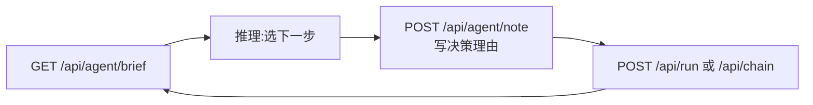

# 29-AI 操作手册

> 给 LLM 操作员（Claude/GPT/本地模型 Agent）的接入契约：如何用本控制台驱动一场域渗透。
> 原则：**AI 做决策层（读简报→选动作→写决策轨迹），流水线做执行层（护栏/幂等/证据）**。

## 一、接入

```bash
~/tools/bin/console.sh            # 启动;stdout 第二行打印 Token
TOK=<启动打印的Token>
H="X-RedOps-Token: $TOK"
B=http://127.0.0.1:8765
```

- 所有 `/api/*` 都要 `$H` 头，否则 401。Token 每次启动重新生成。
- console.sh 输出里拿 token；`ps` 里看不到，别去翻进程参数。

## 二、工作循环（每一步都走这个环）




1. **简报** `GET /api/agent/brief` → 项目/scope/findings/hosts/凭据骨架（无值）/近 10 条历史/最近失败输出尾部/hashqueue 深度/可用工具表。先读简报再决策，**不要重复跑已 tried 成功的动作**（brief.summary.tried_ok 是屏障）。
2. **决策轨迹** `POST /api/agent/note {"text":"选 kerb 链:凭据已验证但无 TGS 哈希", "kind":"decision"}` —— kind ∈ decision/hypothesis/observation。**先写理由再动手**，复盘和报告依赖这条轨迹。
3. **执行**：
   - 单工具 `POST /api/run {"id":"<tool_id>","params":{...}}`
   - 链 `POST /api/chain {"id":"<chain_id>","params":{...}}`
   - 多目标 `POST /api/run_multi {"id":...,"targets":[...],"params":{...}}`（≤32，逐目标过 scope）
   - 响应 `tried_before` 非空 = 此命令此前成功过，换目标或换方法，别原样重跑。
4. 回环到简报，确认 state 变化（findings/hosts/creds 增量）再决策下一步。

## 二·五、内置 LLM 客户端（兜底，默认关）

外部 AI 操作员之外的另一种用法：控制台自己调 LLM。**默认关闭**，配置页开启。

1. ⚙️ 配置页 → AI 区：启用开关 + 三种 API 格式（**OpenAI Chat Completions / Anthropic Messages / OpenAI Responses**）+ Base URL（**任意第三方网关/中转地址一等支持**，含已带 `/v1` 或子路径的网关，不会双拼）+ API Key（脱敏存储）+ 模型 →「测试连接」。
2. 看板出现「🤖 AI 建议」按钮 → 服务端把简报压缩后发给配置的 LLM → 建议渲染在看板，同时自动写 `🤖[AI建议]` 决策轨迹。
3. API 面：`POST /api/agent/ping`（连通性）、`POST /api/agent/advise`（建议）。均受 ai_enabled 闸门（关闭时 403）。
4. 定位：**工具自身自动化优先，AI 仅兜底**。fail_hints/board 规则能覆盖的不要点 AI。

## 三、红线（护栏会拦，但别试探）

| 规则 | 机制 |
|---|---|
| 只打 scope.txt 内的目标 | 越界 403；无 scope 时只有 readonly 工具可用 |
| `danger`/`confirm` 步不自动确认 | API 返 409 need_confirm；**把 409 原样转给人类操作员**，由人决定补 `confirm:true` |
| 喷洒只走 spray-safe / autopwn 内置上限 | 锁定阈值不可读时工具本身会拒绝 |
| 凭据值不出简报 | brief 只有骨架；需要值时用链内 `{{cred:主体}}` 水合（历史中自动脱敏为 ***） |
| 高危痕迹动作（NTDS/中继/委派写）永远人工闸门 | 链里 confirm 步 |

## 四、决策启发式（brief → 动作的映射）

| 简报特征 | 下一步 |
|---|---|
| phases 空 / P1 未完成 | autopwn 或 sweep（只读侦察） |
| creds==0 且 hashqueue==0 | null-enum / asreproast / 喷洒(autopwn 已带护栏) |
| hashqueue>0 | crack-sync（hashcat-queue 完成会自动触发，查 brief 再决定要不要催） |
| creds>0 且 tried 无 bh-collect | bh-collect → BloodHound 路径分析（这是 AI 增值点：读路径选最短利用链） |
| hosts 有 owned==false 且 creds.valid_for 覆盖它 | 横向工具（psexec/wmiexec/evilwinrm） |
| krbtgt 在 creds 里 | 阶段4 域控动作（金票/dcsync）——多数带 confirm，转人工 |
| last_failure 非空 | 先读 out_tail 诊断，再决定重试/换路；fail_hints 已有静态映射可参考 |

## 五、AI 的不可替代位（流水线做不了的）

- **读 BH 图选路径**：bh-queries.py 预置查询 + /api/run 跑自定义 Cypher，由你判断哪条路径代价最小
- **非结构化输出解读**：certipy/nxc 的长输出，收割正则只抓凭据；异常面（新模板、奇怪 ACL）靠你读 last_failure.out_tail 和 rundir 日志（`GET /api/log?p=<路径>`）
- **一次性解析器**：新工具输出格式 → 当场写 5 行解析脚本，比改 harvest 正则快
- **多域推进顺序**：trust-map 输出 + 各域 state，选最弱域切入（见 25 号文档）

## 六、示例会话（压缩）

```bash
curl -s -H "$H" $B/api/agent/brief | jq '.summary, .queue'
curl -s -H "$H" -H 'Content-Type: application/json' $B/api/agent/note \
  -d '{"text":"P1 已完成且有 2 凭据未用,先 bh-collect 拿攻击路径","kind":"decision"}'
curl -s -H "$H" -H 'Content-Type: application/json' $B/api/run \
  -d '{"id":"bh-collect","params":{"dcip":"10.0.0.10","domain":"corp.local","user":"alice","pass":"{{cred:alice}}"}}'
# {{cred:alice}} 由服务端从 state 水合,历史中显示 ***
```
